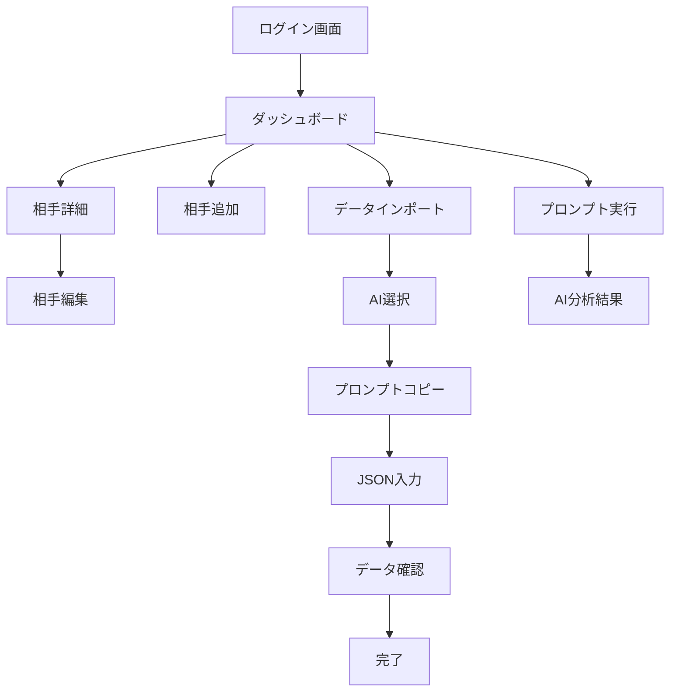

# Miru UI/UXコンプリートガイド
> 恋愛オーケストレーションAIシステムの完全デザイン・体験仕様書

## 📋 目次
1. [プロジェクト概要](#プロジェクト概要)
2. [デザインコンセプト](#デザインコンセプト)
3. [UX原則](#ux原則)
4. [技術スタック](#技術スタック)
5. [デザインシステム](#デザインシステム)
6. [データ構造](#データ構造)
7. [ユーザージャーニー](#ユーザージャーニー)
8. [画面遷移フロー](#画面遷移フロー)
9. [コンポーネント仕様](#コンポーネント仕様)
10. [画面別実装仕様](#画面別実装仕様)
11. [アニメーション詳細](#アニメーション詳細)
12. [エラー・空状態仕様](#エラー・空状態仕様)
13. [AI連携プロンプト](#ai連携プロンプト)
14. [アクセシビリティ](#アクセシビリティ)
15. [パフォーマンス指標](#パフォーマンス指標)
16. [実装順序](#実装順序)
17. [検証チェックリスト](#検証チェックリスト)

---

## プロジェクト概要

### 🌸 Miruとは
「付き合えるかもしれない」希望を可視化する恋愛オーケストレーションAIシステム。Kawaiiデザインで心温まる恋愛体験を提供し、ユーザーの恋愛成功をサポートします。

### 🎯 ミッション
- 恋愛の不安を和らげ、ポジティブな体験を提供
- AIによる分析とアドバイスで恋愛成功をサポート
- 視覚的に魅力的で直感的な操作体験の実現

---

## デザインコンセプト

### 🎨 ビジュアルコンセプト
1. **Kawaii（かわいい）ビジュアル**
   - 丸みを帯びたコンポーネント
   - パステルカラーの配色
   - 楽しいアニメーション
   - 親しみやすい表現

2. **希望と励まし**
   - ポジティブなフィードバック
   - 成功の可視化
   - 温かい表現
   - 科学的信頼性の担保

3. **シンプルで直感的**
   - 明確で一貫したナビゲーション
   - 最小限のクリック数での操作
   - 視覚的ガイドによるフロー設計
   - モバイルファーストのレイアウト

---

## UX原則

### 1. 希望と励まし
- ポジティブな言葉遣いで不安を軽減
- 成功を祝うフィードバック
- 進展を可視化して達成感を提供
- 挫折しそうな時の励ましメッセージ

### 2. シンプルで直感的
- 明確で分かりやすいナビゲーション
- 最小限のステップで目標達成
- ガイド付きフローで迷わない設計
- 専門用語を避けた親しみやすい表現

### 3. 個人化された体験
- ユーザーの状況に応じた推奨アクション
- 学習機能による最適化
- パーソナライズされたメッセージ
- 成長に合わせた機能提案

### 4. エモーショナルデザイン
**ポジティブな言葉遣い例:**
- ❌ "エラーが発生しました" → ✅ "ちょっとした問題が起きちゃいました"
- ❌ "認証に失敗しました" → ✅ "もう一度試してみてください"
- ❌ "データがありません" → ✅ "新しい恋愛の魔法を始めましょう ✨"

---

## 技術スタック

### Frontend
```json
{
  "framework": "Next.js 14.2.29",
  "runtime": "React 18",
  "language": "TypeScript 5.0+",
  "styling": "Tailwind CSS 3.4.0 + CSS Custom Properties",
  "state": "Zustand 4.4.7",
  "icons": "Lucide React",
  "animation": "CSS Animations + Framer Motion",
  "i18n": "next-intl 4.1.0"
}
```

### Backend & Infrastructure
```json
{
  "database": "Supabase PostgreSQL",
  "deployment": "Cloudflare Pages",
  "cdn": "Cloudflare",
  "testing": "Jest + React Testing Library + Playwright"
}
```

---

## デザインシステム

### カラーパレット

#### プライマリカラー
```css
/* ピンク系 */
--pink-400: #EC4899;
--pink-500: #D946EF;
--pink-50: #FDF2F8;
--pink-100: #FCE7F3;
--pink-200: #FBCFE8;

/* パープル系 */
--purple-400: #A855F7;
--purple-500: #9333EA;
--purple-50: #FAF5FF;
--purple-100: #F3E8FF;
--purple-200: #E9D5FF;

/* グラデーション */
--gradient-primary: linear-gradient(to right, #EC4899, #A855F7);
--gradient-bg: linear-gradient(to bottom right, #FDF2F8, #FAF5FF, #EFF6FF);
```

#### 温度カラー（関係性表現）
```css
--temp-hot: #FF5864;     /* 高温（75-100%）*/
--temp-warm: #FFB548;    /* 中温（40-74%）*/
--temp-cool: #4FC3F7;    /* 低温（0-39%）*/
```

#### Kawaiiアクセント
```css
--kawaii-pink: #FFB6C1;
--kawaii-peach: #FFCCCB;
--kawaii-lavender: #E6E6FA;
--kawaii-mint: #F0FFF0;
--kawaii-cream: #FFF8DC;
--kawaii-sky: #E0F6FF;
```

### タイポグラフィ
```css
/* フォントファミリー */
--font-sans: -apple-system, BlinkMacSystemFont, "Segoe UI", "Hiragino Sans", "Noto Sans JP", sans-serif;

/* フォントサイズ */
--text-xs: 0.75rem;    /* 12px */
--text-sm: 0.875rem;   /* 14px */
--text-base: 1rem;     /* 16px */
--text-lg: 1.125rem;   /* 18px */
--text-xl: 1.25rem;    /* 20px */
--text-2xl: 1.5rem;    /* 24px */
--text-3xl: 1.875rem;  /* 30px */
--text-4xl: 2.25rem;   /* 36px */
```

### スペーシング
```css
--space-1: 0.25rem;    /* 4px */
--space-2: 0.5rem;     /* 8px */
--space-3: 0.75rem;    /* 12px */
--space-4: 1rem;       /* 16px */
--space-6: 1.5rem;     /* 24px */
--space-8: 2rem;       /* 32px */
--space-12: 3rem;      /* 48px */
```

### 角丸・シャドウ
```css
/* 角丸 */
--radius-sm: 0.25rem;    /* 4px */
--radius-base: 0.5rem;   /* 8px */
--radius-lg: 1rem;       /* 16px */
--radius-xl: 1.5rem;     /* 24px */
--radius-full: 9999px;   /* 完全円形 */

/* シャドウ */
--shadow-sm: 0 4px 8px 0 rgba(255, 182, 193, 0.2);
--shadow-kawaii-glow: 0 0 20px rgba(255, 182, 193, 0.3);
--shadow-magical: 0 8px 25px rgba(221, 160, 221, 0.4);
```

---

## データ構造

### TypeScript型定義
```typescript
export interface Connection {
  id: string;
  user_id: string;
  nickname: string;
  platform: string;
  current_stage: ConnectionStage;
  basic_info: BasicInfo;
  communication: CommunicationInfo;
  user_feelings: UserFeelings;
  created_at: string;
  updated_at: string;
}

export type ConnectionStage = 
  | 'マッチング直後'
  | 'メッセージ中'
  | 'LINE交換済み'
  | 'デート前'
  | 'デート後'
  | '交際中'
  | '停滞中'
  | '終了';

export interface DashboardData {
  connections: Connection[];
  totalConnections: number;
  activeConnections: number;
  averageScore: number;
  recommendedActions: RecommendedAction[];
  bestConnection: Connection | null;
}
```

---

## ユーザージャーニー

### 1. 発見・認知段階
**目標**: Miruの価値を理解し、使い始める意欲を高める

```
サイト訪問 → 魅力的な説明 → 価値提案の理解 → 
使ってみたいという気持ち → アカウント作成
```

**UX施策**:
- 分かりやすい価値提案
- 成功事例の紹介
- 簡単な登録プロセス
- デモ機能での体験

### 2. オンボーディング段階
**目標**: 初回利用で成功体験を得て、継続利用を促す

```
初回ログイン → ウェルカムメッセージ → 
基本機能の説明 → 最初の相手追加 → 
初回プロンプト生成 → 成功体験 → 継続意欲
```

**UX施策**:
- ステップバイステップガイド
- 親切なツールチップ
- 成功までの明確な道筋
- 小さな勝利の積み重ね

### 3. 日常利用段階
**目標**: 習慣的な利用で恋愛の成功をサポートする

```
ダッシュボード確認 → 今日の推奨アクション → 
プロンプト生成・実行 → 結果の記録 → 
進展の確認 → 次のステップの計画
```

**UX施策**:
- パーソナライズされた推奨
- 進捗の可視化
- 達成感のある通知
- 継続を促すリマインダー

---

## 画面遷移フロー

### メイン画面フロー


---

## コンポーネント仕様

### 基本コンポーネント

#### BottomBar（タブバー）
```tsx
const tabs = [
  { id: 'dashboard', icon: '🏠', label: 'ホーム' },
  { id: 'temperature', icon: '🌡️', label: '温度' },
  { id: 'import', icon: '📥', label: 'インポート' },
  { id: 'ai', icon: '🤖', label: 'AI分析' },
  { id: 'settings', icon: '⚙️', label: '設定' }
];
```

#### ConnectionCard（相手カード）
```tsx
const ConnectionCard: React.FC<ConnectionCardProps> = ({
  connection,
  onEdit,
  onDelete,
  onGeneratePrompt
}) => {
  const score = calculateRelationshipScore(connection);
  const progressWidth = getStageProgress(connection.current_stage);
  
  return (
    <div className="card-kawaii hover-kawaii group animate-fadeIn relative overflow-hidden">
      {/* Kawaii デコレーション */}
      <div className="absolute top-0 right-0 w-16 h-16 bg-kawaii-soft rounded-bl-3xl opacity-30" />
      <div className="absolute -top-2 -right-2 text-2xl animate-sparkle">✨</div>
      
      {/* コンテンツ */}
      <div className="flex justify-between items-start mb-6 relative z-10">
        <div className="min-w-0 flex-1 mr-3">
          <h3 className="text-2xl font-bold text-kawaii-gradient truncate mb-2">
            {connection.nickname}さん 💕
          </h3>
        </div>
      </div>
      
      {/* プログレスバー */}
      <div className="mb-6">
        <div className="w-full bg-pink-100 rounded-full h-4 shadow-inner relative overflow-hidden">
          <div 
            className="gradient-primary h-4 rounded-full transition-all duration-700 shadow-kawaii-glow"
            style={{ width: `${progressWidth}%` }}
          />
        </div>
      </div>
    </div>
  );
};
```

### スタイルクラス定義
```css
/* Kawaiiカード */
.card-kawaii {
  @apply bg-white rounded-3xl p-8 shadow-lg border-2 border-pink-100;
  background: linear-gradient(135deg, #FFF5F5 0%, #FFCCCB 30%, #FFE4E1 100%);
}

.card-kawaii-magical {
  @apply bg-white rounded-3xl p-8 shadow-lg border-2 border-purple-200;
  background: linear-gradient(135deg, #E6E6FA 0%, #DDA0DD 50%, #FFB6C1 100%);
}

/* ボタン */
.btn-kawaii {
  @apply bg-gradient-to-r from-pink-400 to-purple-400 text-white px-6 py-3 rounded-2xl font-bold transition-all duration-300 hover:shadow-lg hover:scale-105;
}

/* テキストグラデーション */
.text-kawaii-gradient {
  background: linear-gradient(135deg, #FF5864 0%, #FFB548 50%, #4FC3F7 100%);
  -webkit-background-clip: text;
  -webkit-text-fill-color: transparent;
  background-clip: text;
}

/* ホバーエフェクト */
.hover-kawaii:hover {
  transform: translateY(-4px) scale(1.02);
  box-shadow: 0 0 20px rgba(255, 182, 193, 0.3);
}
```

---

## 画面別実装仕様

### ダッシュボード画面

#### 空状態画面
```tsx
const EmptyDashboard = () => (
  <div className="min-h-screen bg-kawaii-dream flex items-center justify-center p-4">
    <div className="card-kawaii-magical max-w-2xl mx-auto text-center py-16 animate-bounceIn relative overflow-hidden">
      <div className="absolute top-4 right-4 animate-sparkle text-3xl">✨</div>
      <div className="absolute top-8 left-8 animate-float text-2xl">🌸</div>
      
      <div className="w-32 h-32 mx-auto mb-8 rounded-full bg-kawaii-romantic flex items-center justify-center animate-heartbeat relative">
        <span className="text-6xl">💕</span>
        <div className="absolute inset-0 rounded-full border-4 border-pink-200 animate-pulse" />
      </div>
      
      <h3 className="text-4xl font-bold text-kawaii-gradient mb-6 animate-float">
        新しい恋愛の魔法を始めましょう ✨
      </h3>
      
      <div className="flex flex-col sm:flex-row gap-4 justify-center">
        <button className="btn-kawaii px-8 py-4 text-lg hover-sparkle relative animate-kawaii-pulse">
          <span className="inline mr-2">➕</span> 手動で追加する
        </button>
        <button className="btn-kawaii-secondary px-8 py-4 text-lg hover-sparkle relative animate-kawaii-pulse">
          <span className="inline mr-2">📥</span> AIで一括インポート
        </button>
      </div>
    </div>
  </div>
);
```

#### メインダッシュボード
```tsx
const Dashboard = () => (
  <div className="min-h-screen bg-kawaii-dream">
    <div className="container space-y-8 py-8">
      {/* ヘッダー */}
      <div className="flex flex-col sm:flex-row justify-between items-start sm:items-center gap-6">
        <div className="space-y-3">
          <h1 className="text-3xl sm:text-4xl font-extrabold text-kawaii-gradient animate-float">
            🌸💕 恋愛ダッシュボード ✨
          </h1>
          <p className="text-gray-700 text-lg font-medium">
            あなたの素敵な恋愛を応援するMiruの魔法のインサイト 🪄
          </p>
        </div>
      </div>

      {/* サマリー統計 */}
      <div className="grid grid-cols-1 sm:grid-cols-2 lg:grid-cols-3 gap-6">
        <div className="card-kawaii hover-kawaii group animate-bounceIn">
          <div className="flex items-center">
            <div className="w-16 h-16 rounded-3xl bg-kawaii-romantic flex items-center justify-center group-hover:scale-110 transition-transform animate-float">
              <span className="text-3xl animate-kawaii-pulse">👥</span>
            </div>
            <div className="ml-5 flex-1">
              <p className="text-sm font-semibold text-kawaii-gradient">出会った運命の人</p>
              <div className="flex items-baseline">
                <p className="text-4xl font-extrabold text-kawaii-glow">
                  {dashboardData.totalConnections}
                </p>
                <p className="ml-2 text-sm text-pink-400 font-medium">人 💕</p>
              </div>
            </div>
          </div>
        </div>
      </div>
    </div>
  </div>
);
```

### データインポート画面（5段階ウィザード）

#### ステップ1: AI選択
```tsx
const AISelection = () => (
  <div className="space-y-6">
    <div className="text-center">
      <h3 className="text-2xl font-bold text-kawaii-gradient mb-4">
        🤖 どのAIを使いますか？
      </h3>
      <p className="text-gray-600">
        お使いのAIアシスタントを選択してください
      </p>
    </div>
    
    <div className="grid grid-cols-1 md:grid-cols-3 gap-4">
      {(['claude', 'gpt', 'gemini'] as AIType[]).map((ai) => (
        <button
          key={ai}
          onClick={() => setSelectedAI(ai)}
          className={`p-6 rounded-2xl border-2 transition-all hover:scale-105 ${
            selectedAI === ai
              ? 'border-primary bg-primary/10 shadow-kawaii-glow'
              : 'border-gray-200 hover:border-gray-300'
          }`}
        >
          <div className="text-center">
            <div className="text-4xl mb-3">
              {ai === 'claude' ? '🧠' : ai === 'gpt' ? '💭' : '🌟'}
            </div>
            <h4 className="font-bold text-lg capitalize">{ai}</h4>
          </div>
        </button>
      ))}
    </div>
  </div>
);
```

---

## アニメーション詳細

### Kawaiiアニメーション定義
```css
/* ハートビートアニメーション */
@keyframes heartbeat {
  0%, 100% { transform: scale(1); }
  10%, 30% { transform: scale(1.15); }
  20% { transform: scale(1.08); }
}

/* 浮遊アニメーション */
@keyframes float {
  0%, 100% { transform: translateY(0); }
  50% { transform: translateY(-8px); }
}

/* きらきらアニメーション */
@keyframes sparkle {
  0%, 100% { 
    opacity: 0; 
    transform: scale(0.8) rotate(0deg); 
  }
  50% { 
    opacity: 1; 
    transform: scale(1.2) rotate(180deg); 
  }
}

/* 弾むような登場アニメーション */
@keyframes bounceIn {
  0% {
    transform: scale(0.3) translateY(-50px);
    opacity: 0;
  }
  50% {
    transform: scale(1.05) translateY(-10px);
    opacity: 0.8;
  }
  70% {
    transform: scale(0.98) translateY(0);
    opacity: 1;
  }
  100% {
    transform: scale(1) translateY(0);
    opacity: 1;
  }
}

/* かわいいパルス */
@keyframes kawaii-pulse {
  0%, 100% {
    opacity: 1;
    transform: scale(1);
  }
  50% {
    opacity: 0.7;
    transform: scale(1.02);
  }
}
```

### アニメーション使用ガイドライン
```css
/* 基本的な使用例 */
.animate-heartbeat { animation: heartbeat 1.5s ease-in-out infinite; }
.animate-float { animation: float 3s ease-in-out infinite; }
.animate-sparkle { animation: sparkle 1s ease-in-out infinite; }
.animate-bounceIn { animation: bounceIn 0.6s cubic-bezier(0.68, -0.55, 0.265, 1.55); }
.animate-kawaii-pulse { animation: kawaii-pulse 2s cubic-bezier(0.4, 0, 0.6, 1) infinite; }

/* ホバーエフェクト */
.hover-kawaii {
  transition: all var(--transition-base);
}
.hover-kawaii:hover {
  transform: translateY(-4px) scale(1.02);
  box-shadow: var(--shadow-kawaii-glow);
}
```

---

## エラー・空状態仕様

### エラー状態UI
```tsx
const ErrorState: React.FC<ErrorStateProps> = ({
  title = "ちょっとした問題が起きちゃいました",
  message,
  onRetry,
  type = 'error'
}) => {
  const getIcon = () => {
    switch (type) {
      case 'error': return '😢';
      case 'warning': return '😯';
      case 'info': return '💭';
      default: return '😢';
    }
  };

  return (
    <div className="card-kawaii max-w-md mx-auto text-center py-12 animate-bounceIn">
      <div className="w-20 h-20 mx-auto mb-6 rounded-3xl bg-kawaii-soft flex items-center justify-center animate-wiggle">
        <span className="text-4xl">{getIcon()}</span>
      </div>
      <h3 className="text-2xl font-bold text-kawaii-gradient mb-4">{title}</h3>
      <p className="text-red-600 mb-8 leading-relaxed font-medium">{message}</p>
      {onRetry && (
        <button
          onClick={onRetry}
          className="btn-kawaii px-8 py-4 text-lg hover-sparkle"
        >
          <span className="animate-heartbeat inline mr-2">💕</span> もう一度試してみる
        </button>
      )}
    </div>
  );
};
```

### ローディング状態UI
```tsx
const LoadingState: React.FC<LoadingStateProps> = ({
  message = "恋愛の魔法を分析中...",
  submessage = "素敵な出会いを見つけています"
}) => (
  <div className="min-h-screen bg-kawaii-dream flex items-center justify-center">
    <div className="text-center space-y-6 animate-bounceIn">
      <div className="relative">
        <div className="mx-auto w-20 h-20 rounded-full gradient-primary animate-spin" />
        <div className="absolute inset-0 flex items-center justify-center">
          <span className="text-3xl animate-heartbeat">💕</span>
        </div>
      </div>
      <div className="space-y-2">
        <p className="text-xl font-bold text-kawaii-gradient animate-kawaii-pulse">
          {message}
        </p>
        <p className="text-pink-600 font-medium flex items-center justify-center gap-2">
          <span>🌟</span> {submessage} <span>🌟</span>
        </p>
      </div>
    </div>
  </div>
);
```

---

## AI連携プロンプト

### データインポート用プロンプト
```typescript
const IMPORT_PROMPTS = {
  claude: `あなたは恋愛コンサルタントのAIアシスタントです。
以下の恋愛状況の情報を分析して、JSONフォーマットで構造化してください。

【重要な指示】
- 必ずJSONフォーマットで回答してください
- 個人を特定できる情報は含めないでください
- ニックネームや仮名を使用してください
- current_stageは必ず以下のいずれかにしてください：
  "マッチング直後", "メッセージ中", "LINE交換済み", "デート前", "デート後", "交際中", "停滞中", "終了"

【JSONフォーマット例】
\`\`\`json
[
  {
    "nickname": "Aさん",
    "platform": "Tinder",
    "current_stage": "メッセージ中",
    "basic_info": {
      "age": 28,
      "occupation": "エンジニア",
      "hobbies": ["映画鑑賞", "カフェ巡り"],
      "location": "東京"
    },
    "communication": {
      "frequency": "毎日",
      "lastContact": "昨日",
      "communicationStyle": "親しみやすい",
      "responseTime": "即返信"
    },
    "user_feelings": {
      "expectations": "真剣な交際を希望",
      "concerns": ["距離感", "価値観の違い"],
      "attractivePoints": ["優しさ", "共通の趣味"]
    }
  }
]
\`\`\`

以下の情報を分析してJSONに変換してください：
[ユーザーが入力した恋愛状況の情報]`
};
```

---

## アクセシビリティ

### 視覚的アクセシビリティ
- **コントラスト比**: WCAG AA準拠（4.5:1以上）
- **フォーカス表示**: 明確で視認性の高いアウトライン
- **色覚多様性**: 色だけに依存しない情報伝達
- **文字サイズ**: 拡大に対応したレスポンシブタイポグラフィ

### 操作性の配慮
- **タッチターゲット**: 最小44pxの操作領域
- **キーボード操作**: Tab順序の最適化
- **エラー表示**: 明確で理解しやすいビジュアル
- **ローディング状態**: 視覚的なフィードバック

---

## パフォーマンス指標

### 目標値
- **初回表示**: < 3秒
- **インタラクション**: < 100ms
- **ページ遷移**: < 500ms
- **API応答**: < 1秒

### 最適化手法
- **画像最適化**: WebP形式、遅延読み込み
- **コード分割**: 動的インポート
- **キャッシュ**: ブラウザ・CDNキャッシュ
- **プリフェッチ**: 次画面の先読み

---

## 実装順序

### フェーズ1: 基盤構築（1-2週間）
1. **プロジェクト初期設定**
   - Next.js 14 + TypeScript環境構築
   - Tailwind CSS + カスタムCSS設定
   - ESLint + Prettier設定

2. **デザインシステム実装**
   - CSS変数定義
   - アニメーション定義
   - ユーティリティクラス作成

3. **基本型定義**
   - TypeScript型定義
   - 基本インターフェース定義

### フェーズ2: コアコンポーネント（2-3週間）
1. **レイアウトコンポーネント**
   - RootLayout
   - BottomBar
   - Container

2. **基本UIコンポーネント**
   - Button variants
   - Card variants
   - Input variants
   - Modal base

### フェーズ3: メイン機能（3-4週間）
1. **ダッシュボード**
   - Dashboard.tsx
   - サマリー統計
   - 空状態・エラー状態

2. **コネクション管理**
   - ConnectionCard.tsx
   - ConnectionForm.tsx
   - CRUD操作

3. **データインポート**
   - DataImportModal.tsx
   - 5段階ウィザード
   - AI連携プロンプト

---

## 検証チェックリスト

### デザイン・UI
- [ ] Kawaiiデザインコンセプトの一貫性
- [ ] レスポンシブデザインの動作確認
- [ ] アニメーションの滑らかさ
- [ ] カラーコントラストの適切性（WCAG AA準拠）
- [ ] タッチターゲットサイズ（最小44px）

### 機能
- [ ] 認証フローの動作確認
- [ ] CRUD操作の完全性
- [ ] データインポートの各ステップ
- [ ] AI連携の正常動作
- [ ] エラーハンドリングの適切性

### パフォーマンス
- [ ] 初回読み込み時間（<3秒）
- [ ] インタラクション応答時間（<100ms）
- [ ] バンドルサイズの最適化
- [ ] 画像最適化の実装

### アクセシビリティ
- [ ] キーボードナビゲーション
- [ ] スクリーンリーダー対応
- [ ] フォーカス表示の明確性
- [ ] 色覚多様性への配慮

---

この包括的なUI/UXガイドに従って開発を進めることで、統一感があり、ユーザーフレンドリーで、技術的に堅牢なMiruアプリケーションを構築できます。

実装中に疑問が生じた場合は、この仕様書を参照して一貫性を保つようにしてください。また、新機能追加時は、この仕様書のデザイン原則とコンポーネント構造に従って実装してください。