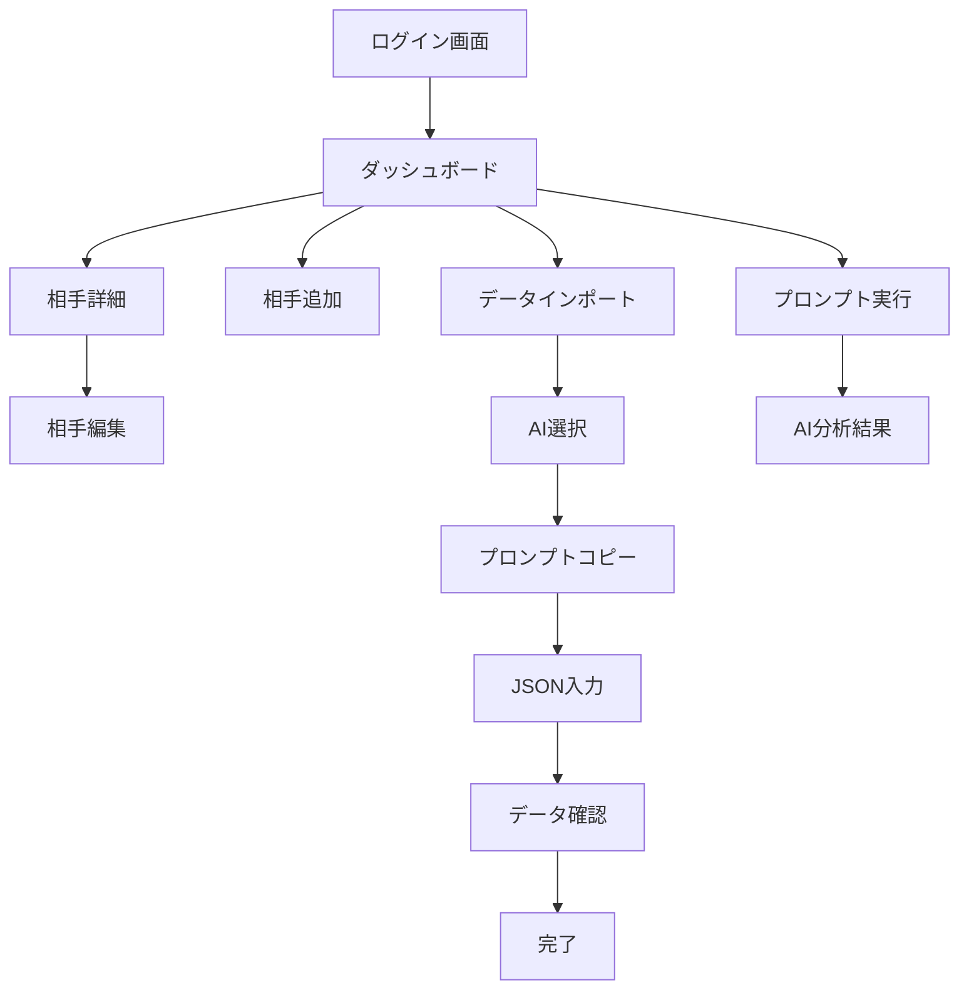

# Miru UI/UX完全実装仕様書 v2.0

## 📋 目次
1. [プロジェクト概要](#プロジェクト概要)
2. [技術スタック](#技術スタック)
3. [プロジェクト構成](#プロジェクト構成)
4. [グローバル設定](#グローバル設定)
5. [データ構造定義](#データ構造定義)
6. [画面遷移フロー](#画面遷移フロー)
7. [コンポーネント完全仕様](#コンポーネント完全仕様)
8. [画面別完全実装仕様](#画面別完全実装仕様)
9. [アニメーション詳細](#アニメーション詳細)
10. [エラー・空状態仕様](#エラー・空状態仕様)
11. [AI連携プロンプト全文](#ai連携プロンプト全文)
12. [実装順序](#実装順序)
13. [検証チェックリスト](#検証チェックリスト)

---

## プロジェクト概要

### 🌸 Miruとは
「付き合えるかもしれない」希望を可視化する恋愛オーケストレーションAIシステム。Kawaiiデザインで心温まる恋愛体験を提供。

### 🎯 デザインコンセプト
- **Kawaii（かわいい）**: 丸みを帯びた要素、パステルカラー、楽しいアニメーション
- **希望と励まし**: ポジティブなフィードバック、成功の可視化、温かい表現
- **科学的信頼性**: AI分析根拠の明示、データ基盤の透明性

---

## 技術スタック

### Frontend
```json
{
  "framework": "Next.js 14.2.29",
  "runtime": "React 18",
  "language": "TypeScript 5.0+",
  "styling": "Tailwind CSS 3.4.0 + CSS Custom Properties",
  "state": "Zustand 4.4.7",
  "icons": "React Icons 5.5.0",
  "animation": "CSS Animations + Framer Motion",
  "i18n": "next-intl 4.1.0"
}
```

### Backend & Infrastructure
```json
{
  "database": "Supabase PostgreSQL",
  "deployment": "Cloudflare Pages",
  "cdn": "Cloudflare",
  "testing": "Jest + React Testing Library + Playwright"
}
```

---

## プロジェクト構成

### ディレクトリ構造
```
src/
├── app/                    # Next.js App Router
│   ├── globals.css        # グローバルスタイル
│   ├── layout.tsx         # ルートレイアウト
│   └── page.tsx           # ホームページ
├── components/            # Reactコンポーネント
│   ├── Dashboard.tsx      # メインダッシュボード
│   ├── LanguageSwitcher.tsx
│   ├── auth/              # 認証関連
│   │   └── AuthModal.tsx
│   ├── connections/       # 接続管理
│   │   ├── ConnectionCard.tsx
│   │   └── ConnectionForm.tsx
│   ├── data-import/       # データインポート
│   │   └── DataImportModal.tsx
│   ├── orchestration/     # プロンプト実行
│   │   ├── PromptOrchestrationPanel.tsx
│   │   └── ScreenshotUpload.tsx
│   └── prompts/           # プロンプト関連
│       └── PromptExecutor.tsx
├── contexts/              # React Context
│   └── AuthContext.tsx
├── lib/                   # ビジネスロジック
│   ├── application/       # アプリケーション層
│   ├── domain/           # ドメイン層
│   ├── infrastructure/   # インフラ層
│   └── *.ts             # サービス層
├── stores/               # Zustand ストア
├── styles/              # スタイル
│   └── design-system.css # デザインシステム
├── types/               # TypeScript型定義
│   ├── index.ts
│   ├── data-import.ts
│   └── romance.ts
└── i18n/               # 国際化
    └── request.ts
```

---

## グローバル設定

### CSS変数システム
```css
:root {
  /* === 基本カラーパレット === */
  --primary: #FF5864;           /* メインピンク */
  --primary-light: #FF7A82;     /* ライトピンク */
  --primary-soft: #FFE0E6;      /* ソフトピンク */
  --primary-bg: #FFF5F5;        /* 背景ピンク */
  
  /* === 温度カラー === */
  --temp-hot: #FF5864;          /* 高温（75-100%）*/
  --temp-warm: #FFB548;         /* 中温（40-74%）*/
  --temp-cool: #4FC3F7;         /* 低温（0-39%）*/
  
  /* === Kawaiiアクセント === */
  --kawaii-pink: #FFB6C1;       /* カワイイピンク */
  --kawaii-peach: #FFCCCB;      /* ピーチ */
  --kawaii-lavender: #E6E6FA;   /* ラベンダー */
  --kawaii-mint: #F0FFF0;       /* ミント */
  --kawaii-cream: #FFF8DC;      /* クリーム */
  --kawaii-sky: #E0F6FF;        /* スカイ */
  
  /* === セマンティックカラー === */
  --success: #4ADE80;
  --warning: #FFA500;
  --error: #FF69B4;
  --info: #87CEEB;
  
  /* === レイアウト === */
  --bottom-bar-height: 56px;
  --app-max-width: 430px;
  --safe-area-top: env(safe-area-inset-top);
  --safe-area-bottom: env(safe-area-inset-bottom);
  
  /* === アニメーション === */
  --transition-fast: 150ms ease-in-out;
  --transition-base: 250ms ease-in-out;
  --transition-slow: 350ms ease-in-out;
  
  /* === タイポグラフィ === */
  --font-sans: -apple-system, BlinkMacSystemFont, "Segoe UI", "Roboto", "Helvetica Neue", "Arial", "Noto Sans", sans-serif;
  --text-xs: 0.75rem;    /* 12px */
  --text-sm: 0.875rem;   /* 14px */
  --text-base: 1rem;     /* 16px */
  --text-lg: 1.125rem;   /* 18px */
  --text-xl: 1.25rem;    /* 20px */
  --text-2xl: 1.5rem;    /* 24px */
  --text-3xl: 1.875rem;  /* 30px */
  --text-4xl: 2.25rem;   /* 36px */
  --text-5xl: 3rem;      /* 48px */
  
  /* === スペーシング === */
  --space-1: 0.25rem;    /* 4px */
  --space-2: 0.5rem;     /* 8px */
  --space-3: 0.75rem;    /* 12px */
  --space-4: 1rem;       /* 16px */
  --space-5: 1.25rem;    /* 20px */
  --space-6: 1.5rem;     /* 24px */
  --space-8: 2rem;       /* 32px */
  --space-12: 3rem;      /* 48px */
  
  /* === 角丸 === */
  --radius-sm: 0.25rem;    /* 4px */
  --radius-base: 0.5rem;   /* 8px */
  --radius-md: 0.75rem;    /* 12px */
  --radius-lg: 1rem;       /* 16px */
  --radius-xl: 1.5rem;     /* 24px */
  --radius-2xl: 2rem;      /* 32px */
  --radius-3xl: 2.5rem;    /* 40px */
  --radius-full: 9999px;   /* 完全円形 */
  
  /* === シャドウ === */
  --shadow-sm: 0 4px 8px 0 rgba(255, 182, 193, 0.2);
  --shadow-base: 0 8px 16px -2px rgba(255, 182, 193, 0.25);
  --shadow-lg: 0 20px 32px -6px rgba(255, 182, 193, 0.35);
  --shadow-kawaii-glow: 0 0 20px rgba(255, 182, 193, 0.3);
  --shadow-magical: 0 8px 25px rgba(221, 160, 221, 0.4);
  
  /* === グラデーション === */
  --gradient-primary: linear-gradient(135deg, #FFB6C1 0%, #FFCCCB 50%, #FFE4E1 100%);
  --gradient-kawaii-dream: linear-gradient(135deg, #FFE4E1 0%, #FFCCCB 30%, #FFB6C1 70%, #DDA0DD 100%);
  --gradient-romantic: linear-gradient(135deg, #FFF0F5 0%, #FFE4E1 30%, #FFCCCB 100%);
  --gradient-magical: linear-gradient(135deg, #E6E6FA 0%, #DDA0DD 50%, #FFB6C1 100%);
}
```

### Tailwindカスタム設定
```javascript
// tailwind.config.js
module.exports = {
  theme: {
    extend: {
      colors: {
        primary: {
          50: '#FFF5F5',
          500: '#FF5864',
          600: '#E85A6F',
        },
        kawaii: {
          pink: '#FFB6C1',
          peach: '#FFCCCB',
          lavender: '#E6E6FA',
          mint: '#F0FFF0',
        },
        temperature: {
          hot: '#FF5864',
          warm: '#FFB548',
          cool: '#4FC3F7',
        }
      },
      animation: {
        'heartbeat': 'heartbeat 1.5s ease-in-out infinite',
        'float': 'float 3s ease-in-out infinite',
        'sparkle': 'sparkle 1s ease-in-out infinite',
        'kawaii-pulse': 'kawaii-pulse 2s cubic-bezier(0.4, 0, 0.6, 1) infinite',
        'bounceIn': 'bounceIn 0.6s cubic-bezier(0.68, -0.55, 0.265, 1.55)',
      }
    }
  }
}
```

---

## データ構造定義

### TypeScript型定義
```typescript
// src/types/index.ts

export interface User {
  id: string;
  email: string;
  created_at: string;
  updated_at: string;
}

export interface Connection {
  id: string;
  user_id: string;
  nickname: string;
  platform: string;
  current_stage: ConnectionStage;
  basic_info: BasicInfo;
  communication: CommunicationInfo;
  user_feelings: UserFeelings;
  created_at: string;
  updated_at: string;
}

export type ConnectionStage = 
  | 'マッチング直後'
  | 'メッセージ中'
  | 'LINE交換済み'
  | 'デート前'
  | 'デート後'
  | '交際中'
  | '停滞中'
  | '終了';

export interface BasicInfo {
  age?: number;
  occupation?: string;
  hobbies?: string[];
  location?: string;
}

export interface CommunicationInfo {
  frequency?: string;
  lastContact?: string;
  communicationStyle?: string;
  responseTime?: string;
}

export interface UserFeelings {
  expectations?: string;
  concerns?: string[];
  attractivePoints?: string[];
}

export interface ProgressEntry {
  id: string;
  connection_id: string;
  distance_level: number; // 1-5
  hope_score: number; // 0-100
  milestone?: string;
  recorded_at: string;
}

export interface DashboardData {
  connections: Connection[];
  totalConnections: number;
  activeConnections: number;
  averageScore: number;
  recommendedActions: RecommendedAction[];
  bestConnection: Connection | null;
}

export interface RecommendedAction {
  id: string;
  connection_id: string;
  title: string;
  description: string;
  urgency: 'low' | 'medium' | 'high' | 'critical';
  estimated_time: string;
  prompt_type: string;
  type: string;
}

export type AIType = 'claude' | 'gpt' | 'gemini';

export interface PromptTemplate {
  id: string;
  category: string;
  title: string;
  description: string;
  template: string;
  ai_types: AIType[];
}
```

---

## 画面遷移フロー

### メイン画面フロー


### 状態管理フロー
```typescript
// Zustand ストア例
interface AppState {
  user: User | null;
  connections: Connection[];
  isLoading: boolean;
  error: string | null;
  setUser: (user: User | null) => void;
  setConnections: (connections: Connection[]) => void;
  addConnection: (connection: Connection) => void;
  updateConnection: (id: string, updates: Partial<Connection>) => void;
  deleteConnection: (id: string) => void;
  setLoading: (loading: boolean) => void;
  setError: (error: string | null) => void;
}
```

---

## コンポーネント完全仕様

### BottomBar（タブバー）
```tsx
// BottomBar.tsx
interface BottomBarProps {
  activeTab: string;
  onTabChange: (tab: string) => void;
}

const BottomBar: React.FC<BottomBarProps> = ({ activeTab, onTabChange }) => {
  const tabs = [
    { id: 'dashboard', icon: '🏠', label: 'ホーム' },
    { id: 'temperature', icon: '🌡️', label: '温度' },
    { id: 'import', icon: '📥', label: 'インポート' },
    { id: 'ai', icon: '🤖', label: 'AI分析' },
    { id: 'settings', icon: '⚙️', label: '設定' }
  ];

  return (
    <nav className="fixed bottom-0 left-0 right-0 h-[var(--bottom-bar-height)] bg-white border-t border-pink-100 safe-bottom z-50">
      <div className="flex h-full max-w-[var(--app-max-width)] mx-auto">
        {tabs.map((tab) => (
          <button
            key={tab.id}
            onClick={() => onTabChange(tab.id)}
            className={`flex-1 flex flex-col items-center justify-center transition-all duration-200 touch-manipulation ${
              activeTab === tab.id
                ? 'text-primary scale-110'
                : 'text-gray-400 hover:text-gray-600'
            }`}
          >
            <span className="text-xl mb-1 animate-bounce-on-active">
              {tab.icon}
            </span>
            <span className="text-xs font-medium">{tab.label}</span>
            {activeTab === tab.id && (
              <div className="absolute bottom-0 w-full h-1 bg-primary rounded-t-lg animate-slide-in" />
            )}
          </button>
        ))}
      </div>
    </nav>
  );
};
```

### ConnectionCard（相手カード）
```tsx
// ConnectionCard.tsx - 完全実装
interface ConnectionCardProps {
  connection: Connection;
  onEdit: (connection: Connection) => void;
  onDelete: (id: string) => void;
  onGeneratePrompt: (id: string) => void;
}

const ConnectionCard: React.FC<ConnectionCardProps> = ({
  connection,
  onEdit,
  onDelete,
  onGeneratePrompt
}) => {
  const score = calculateRelationshipScore(connection);
  const progressWidth = getStageProgress(connection.current_stage);
  
  return (
    <div className="card-kawaii hover-kawaii group animate-fadeIn relative overflow-hidden">
      {/* Kawaii デコレーション */}
      <div className="absolute top-0 right-0 w-16 h-16 bg-kawaii-soft rounded-bl-3xl opacity-30" />
      <div className="absolute -top-2 -right-2 text-2xl animate-sparkle">✨</div>
      
      {/* ヘッダー部分 */}
      <div className="flex justify-between items-start mb-6 relative z-10">
        <div className="min-w-0 flex-1 mr-3">
          <h3 className="text-2xl font-bold text-kawaii-gradient truncate mb-2">
            {connection.nickname}さん 💕
          </h3>
          <div className="flex items-center gap-3">
            <span className="w-3 h-3 rounded-full bg-kawaii-pink animate-kawaii-pulse" />
            <p className="text-sm text-pink-600 font-medium">{connection.platform} ✨</p>
          </div>
        </div>
        
        {/* アクションボタン */}
        <div className="flex gap-3 shrink-0">
          <button
            onClick={() => onEdit(connection)}
            className="w-12 h-12 rounded-2xl bg-kawaii-soft hover:bg-kawaii-pink text-pink-600 hover:text-white transition-all flex items-center justify-center touch-manipulation group-hover:scale-110 hover-bounce"
            title="編集"
          >
            <span className="text-lg">✏️</span>
          </button>
          <button
            onClick={() => onDelete(connection.id)}
            className="w-12 h-12 rounded-2xl bg-red-100 hover:bg-red-200 text-red-500 hover:text-red-600 transition-all flex items-center justify-center touch-manipulation group-hover:scale-110 hover-bounce"
            title="削除"
          >
            <span className="text-lg">🗑️</span>
          </button>
        </div>
      </div>

      {/* ステージとスコア */}
      <div className="flex flex-col sm:flex-row justify-between items-start sm:items-center mb-6 gap-4">
        <span className="badge-kawaii-magical text-white font-bold px-6 py-3 text-base">
          💝 {connection.current_stage}
        </span>
        <div className="flex items-center gap-3 bg-kawaii-romantic px-6 py-3 rounded-2xl border-2 border-pink-200 hover-kawaii">
          <span className="text-sm text-pink-600 font-bold">💖 愛情スコア</span>
          <span className="font-extrabold text-2xl text-kawaii-gradient animate-heartbeat">
            {score}
          </span>
        </div>
      </div>

      {/* プログレスバー */}
      <div className="mb-6">
        <div className="w-full bg-pink-100 rounded-full h-4 shadow-inner relative overflow-hidden">
          <div 
            className="gradient-primary h-4 rounded-full transition-all duration-700 shadow-kawaii-glow relative"
            style={{ width: `${progressWidth}%` }}
          >
            <div className="absolute inset-0 bg-gradient-to-r from-transparent via-white to-transparent opacity-30 animate-pulse" />
          </div>
        </div>
        <div className="flex justify-between mt-3 text-sm text-pink-500 font-medium">
          <span>💕 出会い</span>
          <span>💖 恋愛成就</span>
        </div>
      </div>

      {/* 基本情報 */}
      <div className="mb-6 bg-kawaii-soft rounded-2xl p-5 space-y-4 border border-pink-100">
        {connection.basic_info.age && (
          <div className="flex items-center gap-3">
            <span className="text-xl animate-float">🎂</span>
            <span className="text-base text-pink-700 font-semibold">
              {connection.basic_info.age}歳の素敵な人
            </span>
          </div>
        )}
        {connection.basic_info.occupation && (
          <div className="flex items-center gap-3">
            <span className="text-xl animate-float">💼</span>
            <span className="text-base text-pink-700 font-semibold">
              {connection.basic_info.occupation}
            </span>
          </div>
        )}
        {connection.communication.lastContact && (
          <div className="flex items-center gap-3">
            <span className="text-xl animate-heartbeat">💬</span>
            <span className="text-base text-pink-700 font-semibold">
              最後のお話: {connection.communication.lastContact}
            </span>
          </div>
        )}
      </div>

      {/* 趣味タグ */}
      {connection.basic_info.hobbies && connection.basic_info.hobbies.length > 0 && (
        <div className="mb-6">
          <h4 className="text-base font-bold text-kawaii-gradient mb-4">
            💫 共通の魔法の話題
          </h4>
          <div className="flex flex-wrap gap-3">
            {connection.basic_info.hobbies.map((hobby, index) => (
              <span
                key={index}
                className="badge-kawaii-soft hover-kawaii px-4 py-2 text-sm animate-bounceIn"
                style={{animationDelay: `${index * 0.1}s`}}
              >
                ✨ {hobby}
              </span>
            ))}
          </div>
        </div>
      )}

      {/* 推奨アクション */}
      <div className="mb-6 p-5 bg-kawaii-magical rounded-2xl border-2 border-purple-200 hover-kawaii relative overflow-hidden">
        <div className="absolute top-2 right-2 animate-sparkle text-lg">🌟</div>
        <div className="flex items-center gap-3 mb-3">
          <span className="text-2xl animate-wiggle">🪄</span>
          <h4 className="text-base font-bold text-kawaii-gradient">次の魔法のステップ</h4>
        </div>
        <p className="text-base text-purple-800 font-bold mb-2">
          💫 {getRecommendedAction(connection).title}
        </p>
        <p className="text-sm text-purple-700 line-clamp-2 font-medium">
          {getRecommendedAction(connection).description}
        </p>
      </div>

      {/* アクションボタン */}
      <div className="flex flex-col sm:flex-row gap-4">
        <button
          onClick={() => onGeneratePrompt(connection.id)}
          className="flex-1 btn-kawaii hover-sparkle relative py-4 px-6 text-lg"
        >
          <span className="animate-heartbeat">🤖</span> AIの魔法で相談する ✨
        </button>
        <button
          onClick={() => onEdit(connection)}
          className="px-6 py-4 bg-white border-2 border-pink-200 rounded-2xl hover:border-pink-300 hover:bg-pink-50 transition-all font-bold text-pink-600 touch-manipulation sm:flex-shrink-0 hover-bounce"
        >
          <span className="animate-float">📝</span> 詳細を見る
        </button>
      </div>
    </div>
  );
};
```

### FloatingActionButton（FAB）
```tsx
// FloatingActionButton.tsx
interface FABProps {
  onClick: () => void;
  icon?: string;
  label?: string;
  className?: string;
}

const FloatingActionButton: React.FC<FABProps> = ({ 
  onClick, 
  icon = "➕", 
  label = "追加",
  className = ""
}) => {
  return (
    <button
      onClick={onClick}
      className={`fixed bottom-20 right-6 w-16 h-16 bg-gradient-primary rounded-full shadow-kawaii-glow hover:shadow-lg transform hover:scale-110 active:scale-95 transition-all z-40 flex items-center justify-center animate-float ${className}`}
      aria-label={label}
    >
      <span className="text-2xl animate-heartbeat">{icon}</span>
    </button>
  );
};
```

---

## 画面別完全実装仕様

### ダッシュボード画面
```tsx
// Dashboard.tsx - ダッシュボードメイン画面の完全実装
const Dashboard: React.FC<DashboardProps> = ({ userId }) => {
  const [dashboardData, setDashboardData] = useState<DashboardData | null>(null);
  const [loading, setLoading] = useState(true);

  // ローディング画面
  if (loading) {
    return (
      <div className="min-h-screen bg-kawaii-dream flex items-center justify-center">
        <div className="text-center space-y-6 animate-bounceIn">
          <div className="relative">
            <div className="mx-auto w-20 h-20 rounded-full gradient-primary animate-spin" />
            <div className="absolute inset-0 flex items-center justify-center">
              <span className="text-3xl animate-heartbeat">💕</span>
            </div>
          </div>
          <div className="space-y-2">
            <p className="text-xl font-bold text-kawaii-gradient animate-kawaii-pulse">
              恋愛の魔法を分析中...
            </p>
            <p className="text-pink-600 font-medium flex items-center justify-center gap-2">
              <span>🌟</span> 素敵な出会いを見つけています <span>🌟</span>
            </p>
          </div>
        </div>
      </div>
    );
  }

  // 空状態画面
  if (!dashboardData || dashboardData.connections.length === 0) {
    return (
      <div className="min-h-screen bg-kawaii-dream flex items-center justify-center p-4">
        <div className="card-kawaii-magical max-w-2xl mx-auto text-center py-16 animate-bounceIn relative overflow-hidden">
          <div className="absolute top-4 right-4 animate-sparkle text-3xl">✨</div>
          <div className="absolute top-8 left-8 animate-float text-2xl">🌸</div>
          
          <div className="w-32 h-32 mx-auto mb-8 rounded-full bg-kawaii-romantic flex items-center justify-center animate-heartbeat relative">
            <span className="text-6xl">💕</span>
            <div className="absolute inset-0 rounded-full border-4 border-pink-200 animate-pulse" />
          </div>
          
          <h3 className="text-4xl font-bold text-kawaii-gradient mb-6 animate-float">
            新しい恋愛の魔法を始めましょう ✨
          </h3>
          
          <div className="space-y-4 mb-10">
            <p className="text-pink-700 text-xl leading-relaxed font-medium">
              🌟 Miruと一緒に素敵な恋愛ストーリーを紡いでいきましょう 🌟
            </p>
            <p className="text-pink-600 text-lg leading-relaxed">
              気になる運命の人の情報を追加して、<br />
              愛に満ちた成功への魔法の道筋を見つけましょう！
            </p>
          </div>
          
          <div className="flex flex-col sm:flex-row gap-4 justify-center">
            <button className="btn-kawaii px-8 py-4 text-lg hover-sparkle relative animate-kawaii-pulse">
              <span className="inline mr-2">➕</span> 手動で追加する
            </button>
            <button className="btn-kawaii-secondary px-8 py-4 text-lg hover-sparkle relative animate-kawaii-pulse">
              <span className="inline mr-2">📥</span> AIで一括インポート
            </button>
          </div>
          
          <div className="text-center text-sm text-pink-600 mt-4">
            <p>💡 AIインポートなら、既存の恋愛アプリの状況を簡単に取り込めます</p>
          </div>
        </div>
      </div>
    );
  }

  // メインダッシュボード
  return (
    <div className="min-h-screen bg-kawaii-dream">
      <div className="container space-y-8 py-8">
        {/* ヘッダー */}
        <div className="flex flex-col sm:flex-row justify-between items-start sm:items-center gap-6">
          <div className="space-y-3">
            <h1 className="text-3xl sm:text-4xl font-extrabold text-kawaii-gradient animate-float">
              🌸💕 恋愛ダッシュボード ✨
            </h1>
            <p className="text-gray-700 text-lg font-medium">
              あなたの素敵な恋愛を応援するMiruの魔法のインサイト 🪄
            </p>
          </div>
          <div className="flex flex-col sm:flex-row gap-2">
            <button className="btn-kawaii flex items-center gap-3 touch-manipulation min-h-[48px] w-full sm:w-auto justify-center hover-sparkle relative">
              <span className="text-lg">➕</span>
              <span className="hidden sm:inline">手動で追加</span>
              <span className="sm:hidden">追加</span>
            </button>
            <button className="btn-kawaii-secondary flex items-center gap-3 touch-manipulation min-h-[48px] w-full sm:w-auto justify-center hover-sparkle relative">
              <span className="text-lg">📥</span>
              <span className="hidden sm:inline">AIインポート</span>
              <span className="sm:hidden">インポート</span>
            </button>
          </div>
        </div>

        {/* サマリー統計 */}
        <div className="grid grid-cols-1 sm:grid-cols-2 lg:grid-cols-3 gap-6">
          <div className="card-kawaii hover-kawaii group animate-bounceIn">
            <div className="flex items-center">
              <div className="flex-shrink-0">
                <div className="w-16 h-16 rounded-3xl bg-kawaii-romantic flex items-center justify-center group-hover:scale-110 transition-transform animate-float heart-decoration">
                  <span className="text-3xl animate-kawaii-pulse">👥</span>
                </div>
              </div>
              <div className="ml-5 flex-1">
                <p className="text-sm font-semibold text-kawaii-gradient">出会った運命の人</p>
                <div className="flex items-baseline">
                  <p className="text-4xl font-extrabold text-kawaii-glow">
                    {dashboardData.totalConnections}
                  </p>
                  <p className="ml-2 text-sm text-pink-400 font-medium">人 💕</p>
                </div>
              </div>
            </div>
          </div>

          <div className="card-kawaii hover-kawaii group animate-bounceIn" style={{animationDelay: '0.1s'}}>
            <div className="flex items-center">
              <div className="flex-shrink-0">
                <div className="w-16 h-16 rounded-3xl bg-kawaii-magical flex items-center justify-center group-hover:scale-110 transition-transform animate-float sparkle-decoration">
                  <span className="text-3xl animate-kawaii-pulse">🌟</span>
                </div>
              </div>
              <div className="ml-5 flex-1">
                <p className="text-sm font-semibold text-kawaii-gradient">進展中の関係</p>
                <div className="flex items-baseline">
                  <p className="text-4xl font-extrabold text-kawaii-glow">
                    {dashboardData.activeConnections}
                  </p>
                  <p className="ml-2 text-sm text-purple-400 font-medium">進行中 ✨</p>
                </div>
              </div>
            </div>
          </div>

          <div className="card-kawaii hover-kawaii group sm:col-span-2 lg:col-span-1 animate-bounceIn" style={{animationDelay: '0.2s'}}>
            <div className="flex items-center">
              <div className="flex-shrink-0">
                <div className="w-16 h-16 rounded-3xl bg-kawaii-soft flex items-center justify-center group-hover:scale-110 transition-transform animate-float">
                  <span className="text-3xl animate-heartbeat">💖</span>
                </div>
              </div>
              <div className="ml-5 flex-1">
                <p className="text-sm font-semibold text-kawaii-gradient">愛情スコア平均</p>
                <div className="flex items-baseline">
                  <p className="text-4xl font-extrabold text-kawaii-glow">
                    {dashboardData.averageScore || 0}
                  </p>
                  <p className="ml-2 text-sm text-pink-400 font-medium">点 💕</p>
                </div>
              </div>
            </div>
          </div>
        </div>

        {/* 相手一覧 */}
        <div>
          <div className="flex items-center gap-4 mb-8">
            <div className="w-12 h-12 rounded-2xl bg-kawaii-dream flex items-center justify-center animate-float heart-decoration">
              <span className="text-2xl animate-heartbeat">💕</span>
            </div>
            <h2 className="text-3xl font-bold text-kawaii-gradient">💖 あなたの運命の人たち ✨</h2>
          </div>
          <div className="grid grid-cols-1 sm:grid-cols-2 lg:grid-cols-3 gap-6">
            {dashboardData.connections.map((connection, index) => (
              <div 
                key={connection.id} 
                className="animate-bounceIn" 
                style={{animationDelay: `${index * 0.1}s`}}
              >
                <ConnectionCard
                  connection={connection}
                  onEdit={handleEditConnection}
                  onDelete={handleDeleteConnection}
                  onGeneratePrompt={handleGeneratePrompt}
                />
              </div>
            ))}
          </div>
        </div>
      </div>
    </div>
  );
};
```

### コネクション詳細画面
```tsx
// ConnectionDetail.tsx
const ConnectionDetail: React.FC<ConnectionDetailProps> = ({ connectionId }) => {
  return (
    <div className="min-h-screen bg-kawaii-dream">
      <div className="container py-8">
        {/* ヘッダー */}
        <div className="flex items-center gap-4 mb-8">
          <button className="w-12 h-12 rounded-2xl bg-white hover:bg-gray-50 transition-all flex items-center justify-center shadow-sm">
            <span className="text-xl">⬅️</span>
          </button>
          <h1 className="text-2xl font-bold text-kawaii-gradient">💕 {connection.nickname}さんとの関係</h1>
        </div>

        {/* 温度メーター */}
        <div className="card-kawaii mb-8">
          <div className="text-center mb-6">
            <h2 className="text-xl font-bold text-kawaii-gradient mb-4">💖 現在の愛情温度</h2>
            <div className="relative w-32 h-32 mx-auto">
              <div className="w-full h-full rounded-full bg-gradient-to-br from-temp-cool via-temp-warm to-temp-hot relative">
                <div className="absolute inset-2 bg-white rounded-full flex items-center justify-center">
                  <span className="text-2xl font-bold text-kawaii-gradient">{temperature}°</span>
                </div>
              </div>
            </div>
            <p className="mt-4 text-lg font-medium text-pink-600">
              {getTemperatureMessage(temperature)}
            </p>
          </div>
        </div>

        {/* 進展グラフ */}
        <div className="card-kawaii mb-8">
          <h3 className="text-lg font-bold text-kawaii-gradient mb-4">📈 2週間の進展</h3>
          <div className="h-64 bg-kawaii-soft rounded-xl p-4">
            {/* React Chartjs or similar chart component */}
            <ProgressChart data={progressData} />
          </div>
        </div>

        {/* インサイト一覧 */}
        <div className="card-kawaii mb-8">
          <h3 className="text-lg font-bold text-kawaii-gradient mb-4">✨ AIの恋愛インサイト</h3>
          <div className="space-y-3">
            {insights.map((insight, index) => (
              <div 
                key={index}
                className={`p-4 rounded-xl border-l-4 ${getInsightStyle(insight.type)}`}
              >
                <div className="flex items-start gap-3">
                  <span className="text-lg">{getInsightIcon(insight.type)}</span>
                  <div>
                    <p className="font-medium text-gray-800">{insight.title}</p>
                    <p className="text-sm text-gray-600 mt-1">{insight.description}</p>
                  </div>
                </div>
              </div>
            ))}
          </div>
        </div>

        {/* 推奨アクション */}
        <div className="card-kawaii">
          <h3 className="text-lg font-bold text-kawaii-gradient mb-4">🪄 次にできること</h3>
          <div className="space-y-4">
            {recommendedActions.map((action, index) => (
              <div key={index} className="flex items-center justify-between p-4 bg-kawaii-soft rounded-xl">
                <div>
                  <h4 className="font-bold text-gray-800">{action.title}</h4>
                  <p className="text-sm text-gray-600">{action.description}</p>
                </div>
                <button className="btn-kawaii">
                  実行
                </button>
              </div>
            ))}
          </div>
        </div>
      </div>
    </div>
  );
};
```

### データインポート画面
```tsx
// DataImportModal.tsx - 5段階ウィザード完全実装
const DataImportModal: React.FC<DataImportModalProps> = ({ isOpen, onClose, onImportComplete }) => {
  const [currentStep, setCurrentStep] = useState(1);
  const [selectedAI, setSelectedAI] = useState<AIType | null>(null);
  const [jsonData, setJsonData] = useState('');
  const [parsedData, setParsedData] = useState<Connection[]>([]);

  const steps = [
    { id: 1, title: 'AI選択', icon: '🤖' },
    { id: 2, title: 'プロンプトコピー', icon: '📋' },
    { id: 3, title: 'JSON入力', icon: '📝' },
    { id: 4, title: 'データ確認', icon: '✅' },
    { id: 5, title: '完了', icon: '🎉' }
  ];

  // ステップ1: AI選択
  const renderAISelection = () => (
    <div className="space-y-6">
      <div className="text-center">
        <h3 className="text-2xl font-bold text-kawaii-gradient mb-4">
          🤖 どのAIを使いますか？
        </h3>
        <p className="text-gray-600">
          お使いのAIアシスタントを選択してください
        </p>
      </div>
      
      <div className="grid grid-cols-1 md:grid-cols-3 gap-4">
        {(['claude', 'gpt', 'gemini'] as AIType[]).map((ai) => (
          <button
            key={ai}
            onClick={() => setSelectedAI(ai)}
            className={`p-6 rounded-2xl border-2 transition-all hover:scale-105 ${
              selectedAI === ai
                ? 'border-primary bg-primary/10 shadow-kawaii-glow'
                : 'border-gray-200 hover:border-gray-300'
            }`}
          >
            <div className="text-center">
              <div className="text-4xl mb-3">
                {ai === 'claude' ? '🧠' : ai === 'gpt' ? '💭' : '🌟'}
              </div>
              <h4 className="font-bold text-lg capitalize">{ai}</h4>
              <p className="text-sm text-gray-600 mt-2">
                {getAIDescription(ai)}
              </p>
            </div>
          </button>
        ))}
      </div>
    </div>
  );

  // ステップ2: プロンプトコピー
  const renderPromptCopy = () => {
    const prompt = generateImportPrompt(selectedAI!);
    
    return (
      <div className="space-y-6">
        <div className="text-center">
          <h3 className="text-2xl font-bold text-kawaii-gradient mb-4">
            📋 プロンプトをコピーしてください
          </h3>
          <p className="text-gray-600">
            以下のプロンプトを{selectedAI}にコピー&ペーストしてください
          </p>
        </div>
        
        <div className="bg-gray-100 rounded-xl p-6 relative">
          <pre className="text-sm whitespace-pre-wrap text-gray-800 font-mono">
            {prompt}
          </pre>
          <button
            onClick={() => navigator.clipboard.writeText(prompt)}
            className="absolute top-4 right-4 btn-kawaii-secondary"
          >
            📋 コピー
          </button>
        </div>
        
        <div className="bg-kawaii-soft p-4 rounded-xl">
          <h4 className="font-bold text-kawaii-gradient mb-2">💡 使い方</h4>
          <ol className="text-sm text-gray-700 space-y-1">
            <li>1. 上のプロンプトをコピーします</li>
            <li>2. {selectedAI}に貼り付けて送信します</li>
            <li>3. AIが返してくれたJSONデータをコピーします</li>
            <li>4. 次のステップでJSONを貼り付けます</li>
          </ol>
        </div>
      </div>
    );
  };

  // ステップ3: JSON入力
  const renderJSONInput = () => (
    <div className="space-y-6">
      <div className="text-center">
        <h3 className="text-2xl font-bold text-kawaii-gradient mb-4">
          📝 JSONデータを入力してください
        </h3>
        <p className="text-gray-600">
          AIが返してくれたJSONデータをこちらに貼り付けてください
        </p>
      </div>
      
      <div className="space-y-4">
        <textarea
          value={jsonData}
          onChange={(e) => setJsonData(e.target.value)}
          placeholder="JSONデータをここに貼り付けてください..."
          className="w-full h-64 p-4 border-2 border-gray-200 rounded-xl focus:border-primary focus:outline-none font-mono text-sm"
        />
        
        {jsonData && (
          <div className="flex items-center gap-2 text-sm">
            {isValidJSON(jsonData) ? (
              <>
                <span className="text-green-500">✅</span>
                <span className="text-green-600">有効なJSONです</span>
              </>
            ) : (
              <>
                <span className="text-red-500">❌</span>
                <span className="text-red-600">JSONの形式に問題があります</span>
              </>
            )}
          </div>
        )}
      </div>
    </div>
  );

  // ステップ4: データ確認
  const renderDataConfirmation = () => (
    <div className="space-y-6">
      <div className="text-center">
        <h3 className="text-2xl font-bold text-kawaii-gradient mb-4">
          ✅ インポートするデータを確認
        </h3>
        <p className="text-gray-600">
          以下のデータをインポートします。よろしいですか？
        </p>
      </div>
      
      <div className="bg-kawaii-soft rounded-xl p-6">
        <h4 className="font-bold mb-4">📊 インポート概要</h4>
        <div className="grid grid-cols-2 gap-4 text-center">
          <div className="bg-white rounded-lg p-4">
            <div className="text-2xl font-bold text-kawaii-gradient">{parsedData.length}</div>
            <div className="text-sm text-gray-600">コネクション数</div>
          </div>
          <div className="bg-white rounded-lg p-4">
            <div className="text-2xl font-bold text-kawaii-gradient">{getUniqueStages(parsedData).length}</div>
            <div className="text-sm text-gray-600">ステージ種類</div>
          </div>
        </div>
      </div>
      
      <div className="max-h-64 overflow-y-auto space-y-3">
        {parsedData.map((connection, index) => (
          <div key={index} className="bg-white rounded-lg p-4 border border-gray-200">
            <div className="flex justify-between items-start">
              <div>
                <h5 className="font-bold text-kawaii-gradient">{connection.nickname}</h5>
                <p className="text-sm text-gray-600">{connection.platform}</p>
                <span className="inline-block mt-2 px-3 py-1 bg-kawaii-soft rounded-full text-xs">
                  {connection.current_stage}
                </span>
              </div>
              <div className="text-right">
                <div className="text-lg font-bold text-kawaii-gradient">
                  {calculateRelationshipScore(connection)}
                </div>
                <div className="text-xs text-gray-500">スコア</div>
              </div>
            </div>
          </div>
        ))}
      </div>
    </div>
  );

  // ステップ5: 完了
  const renderCompletion = () => (
    <div className="text-center space-y-6">
      <div className="relative">
        <div className="w-24 h-24 mx-auto rounded-full bg-kawaii-romantic flex items-center justify-center animate-bounceIn">
          <span className="text-4xl animate-heartbeat">🎉</span>
        </div>
        <div className="absolute -top-2 -right-2 animate-sparkle text-2xl">✨</div>
        <div className="absolute -bottom-2 -left-2 animate-float text-xl">🌸</div>
      </div>
      
      <div>
        <h3 className="text-3xl font-bold text-kawaii-gradient mb-4">
          インポート完了！ 🎊
        </h3>
        <p className="text-lg text-gray-600 mb-6">
          {parsedData.length}件のコネクションが正常にインポートされました。<br />
          素敵な恋愛の分析を始めましょう！
        </p>
      </div>
      
      <div className="space-y-4">
        <button
          onClick={() => onImportComplete(parsedData)}
          className="btn-kawaii px-8 py-4 text-lg hover-sparkle relative"
        >
          <span className="animate-heartbeat">💕</span> ダッシュボードに戻る
        </button>
        <p className="text-sm text-gray-500">
          これらのデータはいつでも編集・削除できます
        </p>
      </div>
    </div>
  );

  const renderCurrentStep = () => {
    switch (currentStep) {
      case 1: return renderAISelection();
      case 2: return renderPromptCopy();
      case 3: return renderJSONInput();
      case 4: return renderDataConfirmation();
      case 5: return renderCompletion();
      default: return null;
    }
  };

  if (!isOpen) return null;

  return (
    <div className="fixed inset-0 bg-black bg-opacity-60 backdrop-blur-sm flex items-center justify-center p-4 z-50 animate-fadeIn">
      <div className="bg-white rounded-3xl shadow-2xl max-w-4xl w-full max-h-[90vh] overflow-hidden">
        {/* ヘッダー */}
        <div className="bg-kawaii-dream p-6 border-b border-pink-100">
          <div className="flex items-center justify-between">
            <h2 className="text-2xl font-bold text-kawaii-gradient">
              ✨ AIデータインポート
            </h2>
            <button
              onClick={onClose}
              className="w-10 h-10 rounded-full bg-white/50 hover:bg-white transition-all flex items-center justify-center"
            >
              <span className="text-xl">✕</span>
            </button>
          </div>
          
          {/* プログレスバー */}
          <div className="mt-6">
            <div className="flex items-center justify-between mb-2">
              {steps.map((step, index) => (
                <div key={step.id} className="flex items-center">
                  <div className={`w-10 h-10 rounded-full flex items-center justify-center border-2 transition-all ${
                    currentStep >= step.id
                      ? 'bg-primary border-primary text-white'
                      : 'bg-white border-gray-300 text-gray-400'
                  }`}>
                    <span className="text-sm">{step.icon}</span>
                  </div>
                  {index < steps.length - 1 && (
                    <div className={`flex-1 h-1 mx-2 rounded ${
                      currentStep > step.id ? 'bg-primary' : 'bg-gray-200'
                    }`} />
                  )}
                </div>
              ))}
            </div>
            <div className="text-center">
              <span className="text-sm text-gray-600">
                ステップ {currentStep} / {steps.length}: {steps[currentStep - 1]?.title}
              </span>
            </div>
          </div>
        </div>

        {/* コンテンツ */}
        <div className="p-6 overflow-y-auto max-h-96">
          {renderCurrentStep()}
        </div>

        {/* フッター */}
        <div className="border-t border-gray-100 p-6 bg-gray-50">
          <div className="flex justify-between">
            <button
              onClick={() => setCurrentStep(Math.max(1, currentStep - 1))}
              disabled={currentStep === 1}
              className="px-6 py-3 bg-gray-200 hover:bg-gray-300 disabled:opacity-50 disabled:cursor-not-allowed rounded-xl font-medium transition-all"
            >
              ⬅️ 戻る
            </button>
            <button
              onClick={() => {
                if (currentStep === 5) {
                  onImportComplete(parsedData);
                } else {
                  setCurrentStep(Math.min(5, currentStep + 1));
                }
              }}
              disabled={!canProceed(currentStep, selectedAI, jsonData)}
              className="btn-kawaii px-6 py-3 disabled:opacity-50 disabled:cursor-not-allowed"
            >
              {currentStep === 5 ? '完了 🎉' : '次へ ➡️'}
            </button>
          </div>
        </div>
      </div>
    </div>
  );
};
```

---

## アニメーション詳細

### Kawaiiアニメーション定義
```css
/* heartbeat - ハートビートアニメーション */
@keyframes heartbeat {
  0%, 100% { transform: scale(1); }
  10%, 30% { transform: scale(1.15); }
  20% { transform: scale(1.08); }
}

/* float - 浮遊アニメーション */
@keyframes float {
  0%, 100% { transform: translateY(0); }
  50% { transform: translateY(-8px); }
}

/* sparkle - きらきらアニメーション */
@keyframes sparkle {
  0%, 100% { 
    opacity: 0; 
    transform: scale(0.8) rotate(0deg); 
  }
  50% { 
    opacity: 1; 
    transform: scale(1.2) rotate(180deg); 
  }
}

/* bounceIn - 弾むような登場アニメーション */
@keyframes bounceIn {
  0% {
    transform: scale(0.3) translateY(-50px);
    opacity: 0;
  }
  50% {
    transform: scale(1.05) translateY(-10px);
    opacity: 0.8;
  }
  70% {
    transform: scale(0.98) translateY(0);
    opacity: 1;
  }
  100% {
    transform: scale(1) translateY(0);
    opacity: 1;
  }
}

/* kawaii-pulse - かわいいパルス */
@keyframes kawaii-pulse {
  0%, 100% {
    opacity: 1;
    transform: scale(1);
  }
  50% {
    opacity: 0.7;
    transform: scale(1.02);
  }
}

/* wiggle - 小刻みな揺れ */
@keyframes wiggle {
  0%, 100% { transform: rotate(0deg); }
  25% { transform: rotate(3deg); }
  75% { transform: rotate(-3deg); }
}

/* fadeIn - フェードイン */
@keyframes fadeIn {
  from {
    opacity: 0;
    transform: translateY(15px) scale(0.98);
  }
  to {
    opacity: 1;
    transform: translateY(0) scale(1);
  }
}

/* slideInRight - 右からスライドイン */
@keyframes slideInRight {
  from {
    opacity: 0;
    transform: translateX(25px) scale(0.95);
  }
  to {
    opacity: 1;
    transform: translateX(0) scale(1);
  }
}
```

### アニメーション使用ガイドライン
```css
/* 基本的な使用例 */
.animate-heartbeat { animation: heartbeat 1.5s ease-in-out infinite; }
.animate-float { animation: float 3s ease-in-out infinite; }
.animate-sparkle { animation: sparkle 1s ease-in-out infinite; }
.animate-bounceIn { animation: bounceIn 0.6s cubic-bezier(0.68, -0.55, 0.265, 1.55); }
.animate-kawaii-pulse { animation: kawaii-pulse 2s cubic-bezier(0.4, 0, 0.6, 1) infinite; }
.animate-wiggle { animation: wiggle 0.5s ease-in-out; }
.animate-fadeIn { animation: fadeIn 0.35s ease-out; }
.animate-slideInRight { animation: slideInRight 0.25s ease-out; }

/* ホバーエフェクト */
.hover-kawaii {
  transition: all var(--transition-base);
}
.hover-kawaii:hover {
  transform: translateY(-4px) scale(1.02);
  box-shadow: var(--shadow-kawaii-glow);
}

/* 特別なエフェクト */
.hover-sparkle:hover::after {
  content: "✨";
  position: absolute;
  top: -10px;
  right: -10px;
  animation: sparkle 0.6s ease-out;
}

.heart-decoration::after {
  content: "💕";
  position: absolute;
  top: -5px;
  right: -5px;
  font-size: 1.2em;
  animation: heartbeat 2s ease-in-out infinite;
}
```

---

## エラー・空状態仕様

### エラー状態UI
```tsx
// ErrorState.tsx
interface ErrorStateProps {
  title?: string;
  message: string;
  onRetry?: () => void;
  type?: 'error' | 'warning' | 'info';
}

const ErrorState: React.FC<ErrorStateProps> = ({
  title = "ちょっとした問題が起きちゃいました",
  message,
  onRetry,
  type = 'error'
}) => {
  const getIcon = () => {
    switch (type) {
      case 'error': return '😢';
      case 'warning': return '😯';
      case 'info': return '💭';
      default: return '😢';
    }
  };

  const getColor = () => {
    switch (type) {
      case 'error': return 'text-red-600';
      case 'warning': return 'text-yellow-600';
      case 'info': return 'text-blue-600';
      default: return 'text-red-600';
    }
  };

  return (
    <div className="card-kawaii max-w-md mx-auto text-center py-12 animate-bounceIn">
      <div className="w-20 h-20 mx-auto mb-6 rounded-3xl bg-kawaii-soft flex items-center justify-center animate-wiggle">
        <span className="text-4xl">{getIcon()}</span>
      </div>
      <h3 className="text-2xl font-bold text-kawaii-gradient mb-4">{title}</h3>
      <p className={`${getColor()} mb-8 leading-relaxed font-medium`}>{message}</p>
      {onRetry && (
        <button
          onClick={onRetry}
          className="btn-kawaii px-8 py-4 text-lg hover-sparkle"
        >
          <span className="animate-heartbeat inline mr-2">💕</span> もう一度試してみる
        </button>
      )}
    </div>
  );
};
```

### 空状態UI
```tsx
// EmptyState.tsx
interface EmptyStateProps {
  title: string;
  description: string;
  actionLabel?: string;
  onAction?: () => void;
  icon?: string;
}

const EmptyState: React.FC<EmptyStateProps> = ({
  title,
  description,
  actionLabel,
  onAction,
  icon = "💕"
}) => {
  return (
    <div className="card-kawaii-magical max-w-2xl mx-auto text-center py-16 animate-bounceIn relative overflow-hidden">
      <div className="absolute top-4 right-4 animate-sparkle text-3xl">✨</div>
      <div className="absolute top-8 left-8 animate-float text-2xl">🌸</div>
      
      <div className="w-32 h-32 mx-auto mb-8 rounded-full bg-kawaii-romantic flex items-center justify-center animate-heartbeat relative">
        <span className="text-6xl">{icon}</span>
        <div className="absolute inset-0 rounded-full border-4 border-pink-200 animate-pulse" />
      </div>
      
      <h3 className="text-4xl font-bold text-kawaii-gradient mb-6 animate-float">
        {title} ✨
      </h3>
      
      <div className="space-y-4 mb-10">
        <p className="text-pink-700 text-xl leading-relaxed font-medium">
          {description}
        </p>
      </div>
      
      {actionLabel && onAction && (
        <button
          onClick={onAction}
          className="btn-kawaii px-8 py-4 text-lg hover-sparkle relative animate-kawaii-pulse"
        >
          <span className="inline mr-2">✨</span> {actionLabel}
        </button>
      )}
    </div>
  );
};
```

### ローディング状態UI
```tsx
// LoadingState.tsx
interface LoadingStateProps {
  message?: string;
  submessage?: string;
}

const LoadingState: React.FC<LoadingStateProps> = ({
  message = "恋愛の魔法を分析中...",
  submessage = "素敵な出会いを見つけています"
}) => {
  return (
    <div className="min-h-screen bg-kawaii-dream flex items-center justify-center">
      <div className="text-center space-y-6 animate-bounceIn">
        <div className="relative">
          <div className="mx-auto w-20 h-20 rounded-full gradient-primary animate-spin" />
          <div className="absolute inset-0 flex items-center justify-center">
            <span className="text-3xl animate-heartbeat">💕</span>
          </div>
        </div>
        <div className="space-y-2">
          <p className="text-xl font-bold text-kawaii-gradient animate-kawaii-pulse">
            {message}
          </p>
          <p className="text-pink-600 font-medium flex items-center justify-center gap-2">
            <span>🌟</span> {submessage} <span>🌟</span>
          </p>
        </div>
      </div>
    </div>
  );
};
```

---

## AI連携プロンプト全文

### データインポート用プロンプト
```typescript
// プロンプトテンプレート
const IMPORT_PROMPTS = {
  claude: `あなたは恋愛コンサルタントのAIアシスタントです。
以下の恋愛状況の情報を分析して、JSONフォーマットで構造化してください。

【重要な指示】
- 必ずJSONフォーマットで回答してください
- 個人を特定できる情報は含めないでください
- ニックネームや仮名を使用してください
- current_stageは必ず以下のいずれかにしてください：
  "マッチング直後", "メッセージ中", "LINE交換済み", "デート前", "デート後", "交際中", "停滞中", "終了"

【JSONフォーマット例】
\`\`\`json
[
  {
    "nickname": "Aさん",
    "platform": "Tinder",
    "current_stage": "メッセージ中",
    "basic_info": {
      "age": 28,
      "occupation": "エンジニア",
      "hobbies": ["映画鑑賞", "カフェ巡り"],
      "location": "東京"
    },
    "communication": {
      "frequency": "毎日",
      "lastContact": "昨日",
      "communicationStyle": "親しみやすい",
      "responseTime": "即返信"
    },
    "user_feelings": {
      "expectations": "真剣な交際を希望",
      "concerns": ["距離感", "価値観の違い"],
      "attractivePoints": ["優しさ", "共通の趣味"]
    }
  }
]
\`\`\`

以下の情報を分析してJSONに変換してください：
[ユーザーが入力した恋愛状況の情報]`,

  gpt: `あなたは恋愛分析の専門家です。提供された恋愛関係の情報をJSON形式で構造化してください。

重要な要件：
✅ 必ずJSONフォーマットで回答
✅ プライバシー保護のため仮名を使用
✅ current_stageは指定された値のみ使用

使用可能なステージ：
- "マッチング直後"
- "メッセージ中" 
- "LINE交換済み"
- "デート前"
- "デート後"
- "交際中"
- "停滞中"
- "終了"

期待するJSONフォーマット：
\`\`\`json
[
  {
    "nickname": "山田さん",
    "platform": "Pairs",
    "current_stage": "LINE交換済み",
    "basic_info": {
      "age": 26,
      "occupation": "看護師",
      "hobbies": ["読書", "ヨガ"],
      "location": "大阪"
    },
    "communication": {
      "frequency": "週3-4回",
      "lastContact": "2日前",
      "communicationStyle": "丁寧",
      "responseTime": "1-2時間後"
    },
    "user_feelings": {
      "expectations": "長期的な関係",
      "concerns": ["仕事の忙しさ"],
      "attractivePoints": ["思いやり", "責任感"]
    }
  }
]
\`\`\`

以下の恋愛状況をJSONに変換してください：
[ユーザーの恋愛状況情報]`,

  gemini: `恋愛コンサルタントとして、提供された恋愛関係の情報をJSON形式で整理してください。

📋 作業手順：
1. 提供された情報を分析
2. プライバシーに配慮して仮名を設定
3. 指定されたフォーマットでJSON作成

🎯 必須項目：
- nickname: 仮名（例：Bさん、田中さん）
- platform: 出会った場所/アプリ
- current_stage: 現在の関係ステージ
- basic_info: 基本情報（年齢、職業、趣味、居住地）
- communication: コミュニケーション情報
- user_feelings: ユーザーの気持ち

⚠️ 重要な制約：
current_stageは以下の値のみ使用：
"マッチング直後" | "メッセージ中" | "LINE交換済み" | "デート前" | "デート後" | "交際中" | "停滞中" | "終了"

📝 JSONテンプレート：
\`\`\`json
[
  {
    "nickname": "佐藤さん",
    "platform": "with",
    "current_stage": "デート前",
    "basic_info": {
      "age": 30,
      "occupation": "マーケター",
      "hobbies": ["料理", "旅行"],
      "location": "名古屋"
    },
    "communication": {
      "frequency": "毎日",
      "lastContact": "今朝",
      "communicationStyle": "フレンドリー",
      "responseTime": "30分以内"
    },
    "user_feelings": {
      "expectations": "結婚前提の交際",
      "concerns": ["価値観の確認"],
      "attractivePoints": ["ユーモア", "安定感"]
    }
  }
]
\`\`\`

以下の情報をJSON形式で整理してください：
[ユーザーの恋愛状況]`
};
```

### メッセージ生成用プロンプト
```typescript
const MESSAGE_GENERATION_PROMPTS = {
  first_message: `あなたは恋愛コンサルタントです。以下の相手の情報を基に、自然で魅力的な最初のメッセージを提案してください。

相手の情報：
- ニックネーム: {nickname}
- 年齢: {age}
- 職業: {occupation}
- 趣味: {hobbies}
- プラットフォーム: {platform}

条件：
- 200文字以内
- 自然で親しみやすい雰囲気
- 共通点や相手の魅力に言及
- 質問で終わらせて会話を促進

提案メッセージ：`,

  follow_up: `継続的な会話のためのフォローアップメッセージを提案してください。

現在の状況：
- 相手: {nickname}さん
- 関係ステージ: {current_stage}
- 最後の連絡: {last_contact}
- コミュニケーションスタイル: {communication_style}

前回の会話内容：
{conversation_context}

条件：
- 150文字以内
- 前回の話の流れを汲む
- 相手に負担をかけない
- 興味を引く話題を提供

提案メッセージ：`,

  date_invitation: `デートに誘うためのメッセージを提案してください。

相手の情報：
- ニックネーム: {nickname}
- 趣味・興味: {hobbies}
- これまでの会話の流れ: {conversation_summary}

デート提案の条件：
- カジュアルで圧迫感のない誘い方
- 相手の趣味や興味に関連
- 具体的な提案を含む
- 断りやすい余地も残す

提案メッセージ：`
};
```

### 分析用プロンプト
```typescript
const ANALYSIS_PROMPTS = {
  relationship_analysis: `恋愛関係の分析を行ってください。

分析対象：
- 相手: {nickname}さん
- 現在のステージ: {current_stage}
- 交際期間: {duration}
- コミュニケーション頻度: {frequency}

分析項目：
1. 現在の関係性の健全度（1-10点）
2. 次のステップへの可能性
3. 改善できるポイント
4. 推奨アクション
5. 注意すべき点

各項目について具体的にアドバイスしてください。`,

  compatibility_check: `相性分析を実施してください。

あなたの情報：
{user_profile}

相手の情報：
{partner_profile}

分析内容：
- 価値観の一致度
- ライフスタイルの適合性
- コミュニケーションスタイルの相性
- 長期的な関係の展望
- 改善提案

総合的な相性スコア（1-100点）も含めてください。`
};
```

---

## 実装順序

### フェーズ1: 基盤構築（1-2週間）
1. **プロジェクト初期設定**
   - Next.js 14 + TypeScript環境構築
   - Tailwind CSS + カスタムCSS設定
   - ESLint + Prettier設定

2. **デザインシステム実装**
   - CSS変数定義（design-system.css）
   - アニメーション定義
   - ユーティリティクラス作成

3. **基本型定義**
   - TypeScript型定義（types/index.ts）
   - 基本インターフェース定義

### フェーズ2: コアコンポーネント（2-3週間）
1. **レイアウトコンポーネント**
   - RootLayout
   - BottomBar
   - Container

2. **基本UIコンポーネント**
   - Button variants
   - Card variants
   - Input variants
   - Modal base

3. **認証システム**
   - AuthModal
   - AuthContext
   - Supabase連携

### フェーズ3: メイン機能（3-4週間）
1. **ダッシュボード**
   - Dashboard.tsx
   - サマリー統計
   - 空状態・エラー状態

2. **コネクション管理**
   - ConnectionCard.tsx
   - ConnectionForm.tsx
   - CRUD操作

3. **データインポート**
   - DataImportModal.tsx
   - 5段階ウィザード
   - AI連携プロンプト

### フェーズ4: AI機能（2-3週間）
1. **プロンプト実行**
   - PromptExecutor.tsx
   - AI分析結果表示
   - エラーハンドリング

2. **スコア計算**
   - 関係性スコア算出
   - 希望スコア計算
   - 進展度可視化

### フェーズ5: 最適化・テスト（2週間）
1. **パフォーマンス最適化**
   - コード分割
   - 画像最適化
   - バンドルサイズ削減

2. **テスト実装**
   - Unit tests
   - Integration tests
   - E2E tests

3. **アクセシビリティ対応**
   - ARIA属性
   - キーボードナビゲーション
   - スクリーンリーダー対応

---

## 検証チェックリスト

### デザイン・UI
- [ ] Kawaiiデザインコンセプトの一貫性
- [ ] レスポンシブデザインの動作確認
- [ ] アニメーションの滑らかさ
- [ ] カラーコントラストの適切性（WCAG AA準拠）
- [ ] タッチターゲットサイズ（最小44px）

### 機能
- [ ] 認証フローの動作確認
- [ ] CRUD操作の完全性
- [ ] データインポートの各ステップ
- [ ] AI連携の正常動作
- [ ] エラーハンドリングの適切性

### パフォーマンス
- [ ] 初回読み込み時間（<3秒）
- [ ] インタラクション応答時間（<100ms）
- [ ] バンドルサイズの最適化
- [ ] 画像最適化の実装

### アクセシビリティ
- [ ] キーボードナビゲーション
- [ ] スクリーンリーダー対応
- [ ] フォーカス表示の明確性
- [ ] 色覚多様性への配慮

### モバイル対応
- [ ] iOS/Android実機での動作確認
- [ ] セーフエリアの適切な処理
- [ ] タッチジェスチャーの動作
- [ ] 画面回転への対応

### セキュリティ
- [ ] APIキーの環境変数化
- [ ] 入力値検証の実装
- [ ] SQLインジェクション対策
- [ ] XSS対策

### デプロイ
- [ ] Cloudflare Pagesでのビルド成功
- [ ] 本番環境での動作確認
- [ ] SSL証明書の有効性
- [ ] CDN配信の動作確認

---

この実装仕様書v2.0に従って開発を進めることで、統一感があり、ユーザーフレンドリーで、技術的に堅牢なMiruアプリケーションを構築できます。

実装中に疑問が生じた場合は、この仕様書を参照して一貫性を保つようにしてください。また、新機能追加時は、この仕様書のデザイン原則とコンポーネント構造に従って実装してください。